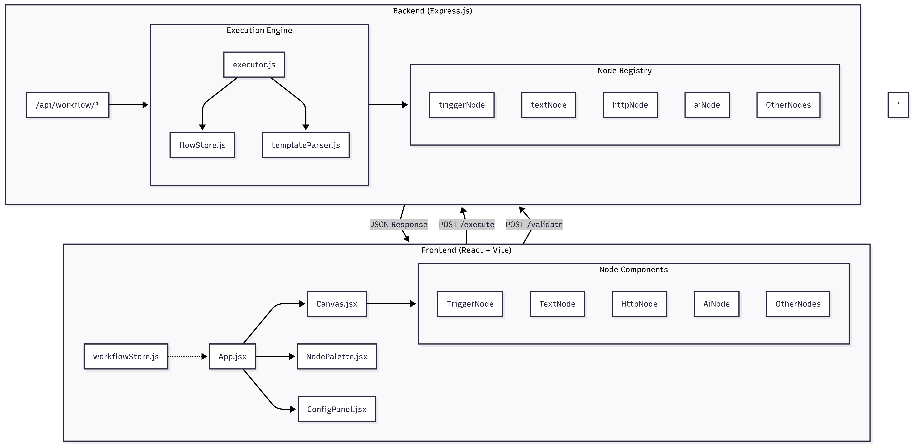

# ⛓️ Chainmail

A lightweight, extensible workflow automation engine inspired by Zapier and n8n. Build, visualize, and execute automated workflows with a beautiful drag-and-drop interface.


## ✨ Features

### Backend Engine
- **Workflow Execution** - Execute multi-step workflows with proper dependency handling
- **Template System** - Reference previous node outputs using `{{nodeId.field}}` syntax
- **Topological Sorting** - Automatic execution order based on node connections (Kahn's algorithm)
- **Error Handling** - Configurable error behavior (`stop` or `continue`)
- **Extensible Architecture** - Easy to add new node types

### Frontend Builder
- **Visual Canvas** - Drag-and-drop workflow builder using React Flow
- **Node Palette** - Select from available node types
- **Configuration Panel** - Configure node parameters in real-time
- **Live Execution** - Execute workflows directly from the UI
- **Validation** - Validate workflows before execution

## 🧩 Available Nodes

| Node Type | Description | Status |
|-----------|-------------|--------|
| **Trigger** | Entry point for workflows, accepts initial payload | ✅ Ready |
| **Text** | Output static or dynamic text | ✅ Ready |
| **HTTP** | Make HTTP requests (GET, POST, PUT, DELETE) | ✅ Ready |
| **AI** | LLM integration (placeholder for AI providers) | ✅ Ready |

## 🏗️ Tech Stack

### Backend
- **Runtime**: Node.js (ES Modules)
- **Framework**: Express.js 5
- **Features**: CORS enabled, JSON parsing

### Frontend
- **Framework**: React 19 + Vite
- **Flow Editor**: @xyflow/react (React Flow)
- **State Management**: Zustand
- **Styling**: Vanilla CSS

## 🚀 Getting Started

### Prerequisites
- Node.js 18+ 
- npm or yarn

### Installation

```bash
# Clone the repository
git clone https://github.com/yourusername/chainmail.git
cd chainmail

# Install backend dependencies
cd backend
npm install

# Install frontend dependencies
cd ../frontend
npm install
```

### Running the Application

**Start the Backend (Port 3000):**
```bash
cd backend
npm run dev
```

**Start the Frontend (Port 5173):**
```bash
cd frontend
npm run dev
```

Open your browser to `http://localhost:5173` to access the workflow builder.

## 📡 API Endpoints

| Endpoint | Method | Description |
|----------|--------|-------------|
| `/api/workflow/execute` | POST | Execute a workflow |
| `/api/workflow/validate` | POST | Validate a workflow |
| `/health` | GET | Health check |

### Example Workflow Request

```json
{
  "id": "my-workflow",
  "triggerPayload": {
    "name": "John"
  },
  "nodes": [
    {
      "type": "trigger",
      "parameters": {}
    },
    {
      "type": "text",
      "parameters": {
        "text": "Hello, {{trigger.name}}!"
      }
    }
  ],
  "connections": [
    { "from": 0, "to": 1 }
  ]
}
```

## 🔧 Adding Custom Nodes

Chainmail makes it easy to extend with new node types. See the [Adding Nodes Guide](backend/docs/adding-nodes.md) for detailed instructions.

**Quick Example:**
```javascript
// src/nodes/myNode.js
import { createNode } from './baseNode.js';

export const myNode = createNode(async (parameters, flowStore) => {
  const { input } = parameters;
  return { result: input.toUpperCase() };
});

// Register in src/index.js
registerNode('myNode', myNode);
```

## 🏛️ Architecture



---

## 🗺️ Future Plans

Adding **one new node every day** to expand Chainmail's capabilities, and gradually improving the UI.

---

## 🤝 Contributing

Contributions are welcome!

## 📄 License

ISC License - feel free to use this project for personal or commercial purposes.

---

**Built with ❤️ as a learning project**

*Started: January 2026*
